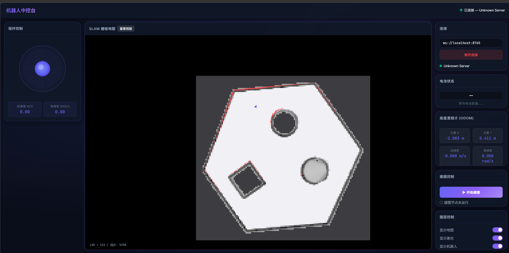

# 机器人中控台 (Robot Control Console)

## 项目简介
这是一个基于 Web 的机器人中控台，用于实时监控和控制 ROS 2 机器人。该项目集成了地图展示、摇杆控制、状态监测以及建图管理等功能。

## 核心功能
*   实时 SLAM 栅格地图显示。
*   机器人摇杆远程控制。
*   电池电压与里程计数据实时监测。
*   可视化建图控制（开始/停止建图）。
*   地图保存功能，支持在网页端输入地图名称。
*   视图自动重置功能，在开始建图/导航时自动对齐视野。
*   页面自动连接 Foxglove WebSocket（默认 `ws://<页面主机>:8765`）。
*   连接成功会显示“已连接”，连接失败会显示错误信息。

## 环境要求
*   Ubuntu 22.04 (WSL 兼容)
*   ROS 2 Humble
*   Node.js (建议版本 v18+)
*   foxglove_bridge

## 快速启动
在项目根目录下执行以下脚本，即可同时启动后端服务和前端界面：
```bash
bash start_console.sh
```
启动成功后，在浏览器访问：`http://localhost:5173`

## 配置说明
项目核心逻辑由 `ros_config.json` 驱动，你可以直接在该文件中修改 ROS 2 指令：
*   `startup`: 配置后台自动运行的任务（如 Foxglove Bridge 的高带宽模式设置）。
*   `mapping`: 配置建图算法及其参数。
*   `navigation`: 配置导航启动命令及参数。
*   `save_map`: 配置地图保存命令及保存路径。
*   `topics`: 配置前端使用的话题名（不同机器人可直接改这里）。

`topics` 典型字段：
*   `cmd_vel`
*   `battery`
*   `map`
*   `scan`
*   `tf`
*   `odom`
*   `plan`
*   `goal_pose`
*   `initial_pose`
*   `navigate_feedback`
*   `imu`

## 地图保存说明
通过网页端保存的地图文件（.yaml 和 .pgm）默认存储在以下路径：
`/home/jiang/workspace/fishbot/maps`

## 技术路线
*   前端框架：Vue 3 + Vite
*   后端服务：Node.js (Express)
*   协议：Foxglove WebSocket v1 协议
*   机器人系统：ROS 2
